# UCSD Remote Server Loggin Tutorial
To log into your UCSD remote server, there are few things you need to do.
## Step1: know your course username
Go [here](https://sdacs.ucsd.edu/~icc/index.php) to look up your course username
1. put your username here( the part of your UCSD email *before @*)
> e.g. This is my email *m1ren@ucsd.edu*, so username will be: *m1ren*

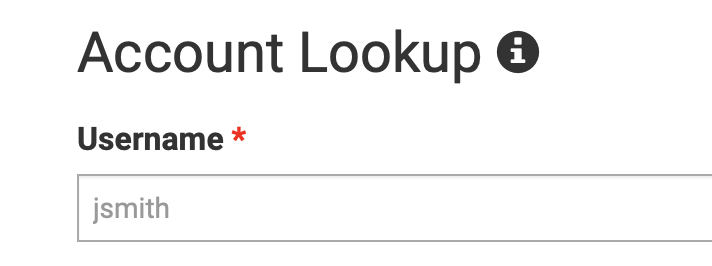

2. enter your PID here( On your student ID, begin with 'A')

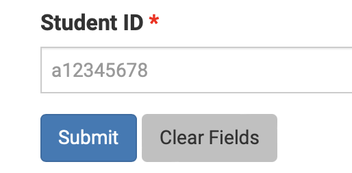

3. click "submit", then you will see your username for all your classes

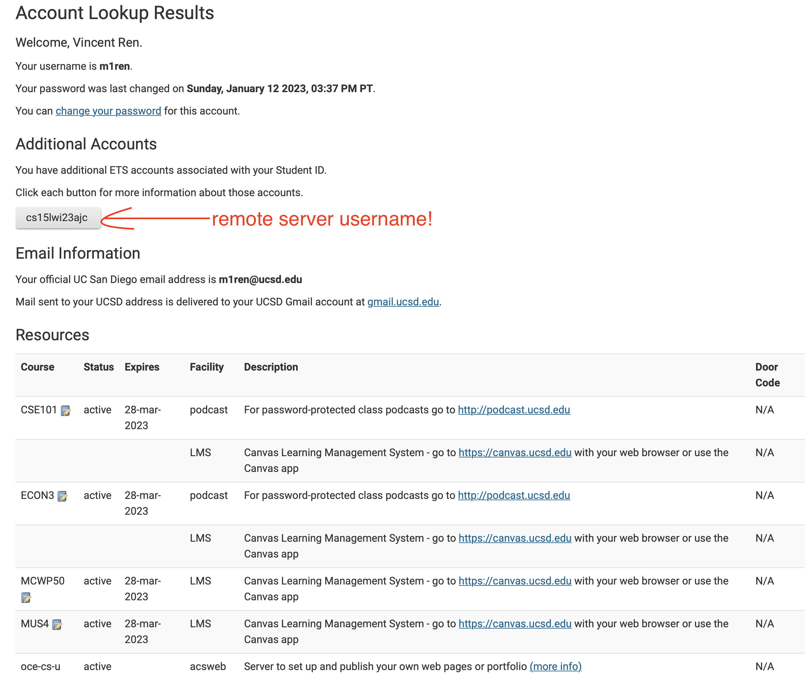

4. if you don't know your password or forget you password, reset your password.
It takes around 15 minutes to update. Take a cup of coffee and wait~

## Step2: Login Through VS Code
1. If you have installed VS Code, skip to this step. 
Install your VS Code at [VS Code](https://code.visualstudio.com/).

2. Click "terminal", "new terminal" on topbar.

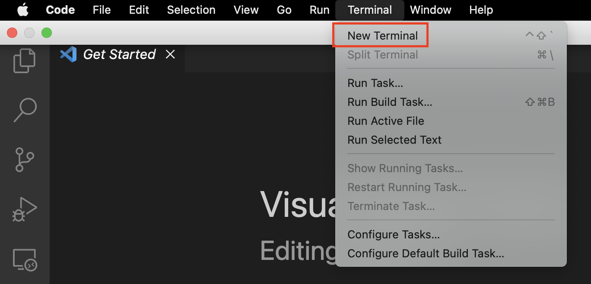

3. Type in `ssh yourusername@igen6.ucsd.edu`
4. Enter your password and, if there are promts showing up, choose all *yes*.
5. Now you should successfully logged into remote server. Your terminal should notice like this:

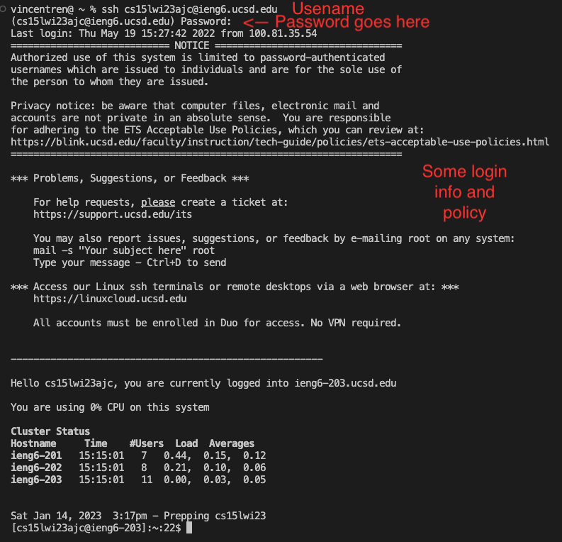

## Step3: Login Through Terminal (Mac OS)
This step is similar to *Step 2*, but it's via *OS terminal*.

1. Open "spotlight Search on your mac.
You can either use hot key "command + space", or little search icon on top right of your menu bar 

2. Type in "terminal" to open terminal.

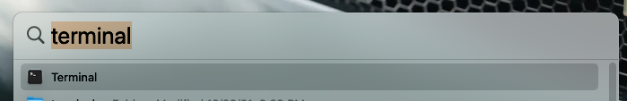

3. Follow steps on **Step 2: 3 ~ 5** to login through terminal.

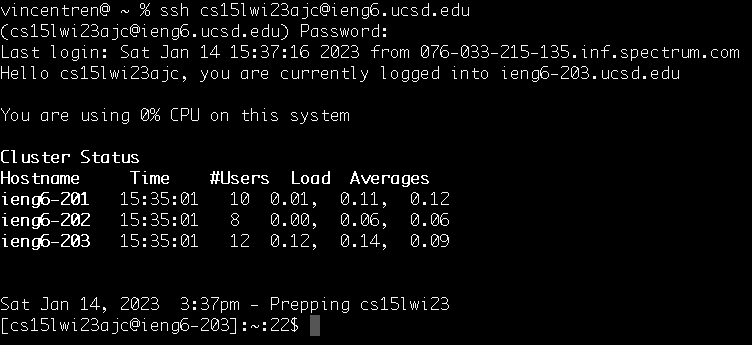

## Step4: Try Some Bacis Command
1. `cat <path1> <path2> ... ` Prints the *contents* of one or more files given by the paths.

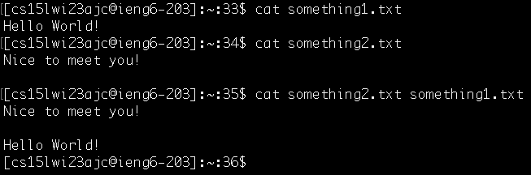

2. `ls <path>` List the files and folders the given path. Add flag `-l` to get long list.

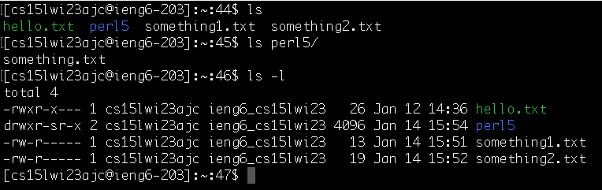

3. `pwd` Print current working directory.

4. `cd <path>` Change directory. Switch the current working directory to the given path.

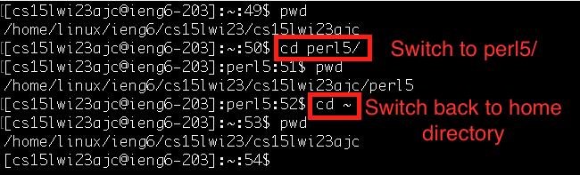

## Step5: Disconnect Remote Server
Very simle!. Type comman `exit` then you're good!

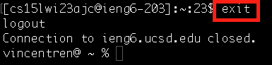
